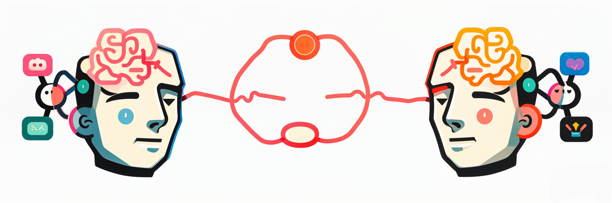

<!-- PROJECT LOGO -->
<br />

<p align="center">
  <a href="https://github.com/turnwind/llmemochain/">
    
  </a>

  <h3 align="center">MECoT:Markov Emotional Chain-of-Thought for Personality-Consistent Role-Playing</h3>
  <p align="center">
    <a href="https://github.com/turnwind/llmemochain">Demo</a>
    ·
    <a href="https://github.com/turnwind/llmemochain/issues">Report Bug</a>
    ·
    <a href="https://github.com/turnwind/llmemochain/issues">Request Feature</a>
  </p>

</p>


<p align="center">
  <a href="https://github.com/turnwind/llmemochain/graphs/contributors">
    
  </a>
  <a href="https://github.com/turnwind/llmemochain/network/members">
    
  </a>
  <a href="https://github.com/turnwind/llmemochain/stargazers">
    
  </a>
  <a href="https://github.com/turnwind/llmemochain/issues">
    
  </a>
  <a href="https://github.com/turnwind/llmemochain/blob/master/LICENSE.txt">
    
  </a>
</p>

## About The Project

MECoT (Markov Emotional Chain-of-Thought) is a novel framework that enhances LLMs' ability to generate authentic personality-driven dialogues through stochastic emotional transitions. By combining Markov-chain-driven emotional processing with LLM-based reasoning, MECoT achieves both emotional coherence and character consistency in role-playing scenarios.

### Key Features

- **Dual-Process Architecture**: Combines intuitive emotional transitions (System 1) with rational LLM-based reasoning (System 2)
- **12-Dimensional Emotion Circumplex Model**: Maps emotions onto a comprehensive psychological space
- **Dynamic Personality Adaptation**: Automatically adjusts emotional weights based on character interactions
- **Historical Context Integration**: Maintains conversation coherence through contextual memory
- **93.3% Emotional Accuracy**: Validated on the RAPD (Role-playing And Personality Dialogue) dataset

### Core Components

1. **Emotion Processor**
   - 12-state Markov chain for emotional transitions
   - Personality-weighted transition matrices
   - Dynamic weight optimization

2. **LLM Reasoning Module**
   - Context-aware response generation
   - Emotional state regulation
   - Personality consistency checks

3. **Training Framework**
   - Data-driven personality optimization
   - Momentum-based weight updates
   - Stability constraints (ε-bounded weights)

## Configuration

### API Keys Setup

MECoT supports multiple LLM services. Set up your preferred service's API key using environment variables:

**Windows Command Prompt:**
```cmd
set ARK_API_KEY=your_ark_key
set OPENAI_API_KEY=your_openai_key
set DEEPSEEK_API_KEY=your_deepseek_key
```

**Windows PowerShell:**
```powershell
$env:ARK_API_KEY="your_ark_key"
$env:OPENAI_API_KEY="your_openai_key"
$env:DEEPSEEK_API_KEY="your_deepseek_key"
```

**Linux/Mac:**
```bash
export ARK_API_KEY=your_ark_key
export OPENAI_API_KEY=your_openai_key
export DEEPSEEK_API_KEY=your_deepseek_key
```

You can also create a `.env` file in your project root:
```plaintext
ARK_API_KEY=your_ark_key
OPENAI_API_KEY=your_openai_key
DEEPSEEK_API_KEY=your_deepseek_key
```

### Service Selection

When initializing a character, you can specify the LLM service:
```python
from model.harry_potter_llm import HarryPotterLLM

# Use default service (doubao)
harry = HarryPotterLLM()

# Or specify a different service
harry = HarryPotterLLM(service_type="openai")
```

Supported services:
- `doubao` (default): Uses Volcengine's Ark service
- `openai`: Uses OpenAI API
- `deepseek`: Uses Deepseek API

## Getting Started

### Prerequisites

```bash
pip install -r requirements.txt
```

### Basic Usage

```python
from model.emotion import EmotionalAgent
from model.trainer import PersonalityWeightOptimizer

# Initialize character
agent = EmotionalAgent(
    name="Character Name",
    personalities={
        "trait1": 0.3,
        "trait2": 0.3,
        "trait3": 0.2,
        "trait4": 0.2
    }
)

# Generate emotional response
response = agent.get_next_emotion("Input context")

# Train personality weights
optimizer = PersonalityWeightOptimizer(
    epsilon=0.05,  # Weight lower bound
    alpha=0.1,     # Learning rate
    beta=0.9       # Momentum coefficient
)
```

### Example: Harry Potter Character

```python
from model.harry_potter_llm import HarryPotterLLM

harry = HarryPotterLLM()
response = harry.emotion_chat(
    "What do you think about facing Voldemort?",
    history=previous_messages
)
print(f"Emotion: {response.emotion}")
print(f"Response: {response.message}")
```

## Technical Details

### Emotion Circumplex Model

The framework uses a 12-dimensional emotion space with the following states:
- neutral [0, 0]
- surprised [0.383, 0.924]
- happy [0.707, 0.707]
- pleased [0.924, 0.383]
- fearful [-0.383, 0.924]
- angry [-0.707, 0.707]
- grieved [-0.924, 0.383]
- sad [-0.924, -0.383]
- disgusted [-0.707, -0.707]
- depressed [-0.383, -0.924]
- tired [0.383, -0.924]
- calm [0.707, -0.707]
- relieved [0.924, -0.383]

### Weight Optimization

The personality weights are dynamically optimized using:
```
P[j_true] ← P[j_true] + α·(1 - P[j_true])
P[j] ← P[j] - α·P[j] (∀j ≠ j_true)
```

With stability constraints:
- Weight lower bound: P[j] ≥ ε
- Momentum: P_t = βP_{t-1} + (1-β)P_new
- Weight normalization: Σ P[j] = 1

## 目录

- [目录](#目录)
  - [上手指南](#上手指南)
  - [版权说明](#版权说明)
  - [鸣谢](#鸣谢)

### 上手指南

### 版权说明

该项目签署了MIT 授权许可，详情请参阅 [LICENSE.txt](https://github.com/turnwind/llmemochain/blob/main/LICENSE.txt)

### 鸣谢

- [GitHub Pages](https://pages.github.com)

<!-- links -->
[your-project-path]:turnwind/llmemochain
[contributors-shield]: https://img.shields.io/github/contributors/turnwind/llmemochain.svg?style=flat-square
[contributors-url]: https://github.com/turnwind/llmemochain/graphs/contributors
[forks-shield]: https://img.shields.io/github/forks/turnwind/llmemochain.svg?style=flat-square
[forks-url]: https://github.com/turnwind/llmemochain/network/members
[stars-shield]: https://img.shields.io/github/stars/turnwind/llmemochain.svg?style=flat-square
[stars-url]: https://github.com/turnwind/llmemochain/stargazers
[issues-shield]: https://img.shields.io/github/issues/turnwind/llmemochain.svg?style=flat-square
[issues-url]: https://img.shields.io/github/issues/turnwind/llmemochain.svg
[license-shield]: https://img.shields.io/github/license/turnwind/llmemochain.svg?style=flat-square
[license-url]: https://github.com/turnwind/llmemochain/blob/master/LICENSE.txt
